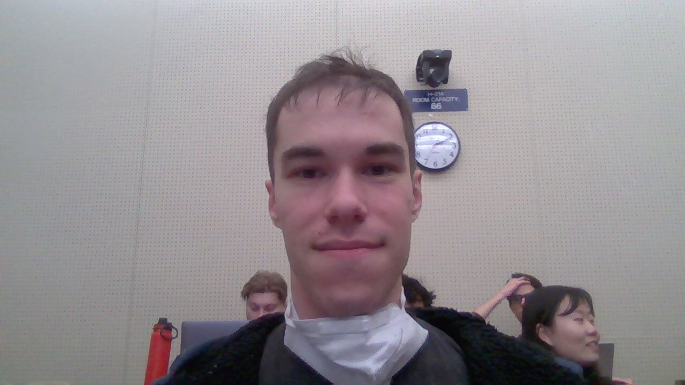
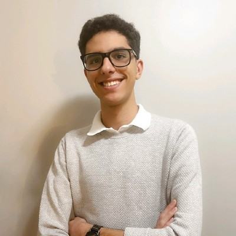

# Team Information

## First Last

UTORID

email

Description

## Ethan Cook

cooketh3

ethanwayne.cook@mail.utoronto.ca

I am a 3rd year Computer Science student at University of Toronto Scarborough with a focus on Software Development. Passionate in developing scalable, high quality web and games software with readable, optimized, and well tested code. In my spare time, my main hobby is music. I play Trombone and Piano, and enjoy most to play jazz music.

Student #: 1008305371
UTORID: schekhtm
Outlook: sean.shekhtman@mail.utoronto.ca

I’m Sean Shekhtman! A friendly guy who enjoys going (very) deep into
things, and so I may be a bit slow at times. Once I’m satisfied, I begin my
work at a break-neck pace! I’ve worked with a few open-source projects
here and there, during my free time. I enjoy helping people understand
concepts (perhaps I’ll make for a good TA once I work up the courage
to enlist as one!) and bouncing different ideas to look for the most efficient (though perhaps not the most readable) solutions. My favourite programming language is C, as I find it to be the easiest to debug and maintains a close relationship with the hardware. As you can tell, I’m a pretty low-level guy, so things like Java or CSS may take me some time to get used to. Looking forward to working with my group!

## Francis Ayyad

Hey, I'm Francis Ayyad. I'm a third year Computer Science student Specializing in Software Engineering and minoring in statistics. I have some web development expreience with PHP gained through my co-op experience. My favoirte programming language is C since I am probbably best at this language from University. In my free time, I enjoy watching football/soccer games and supporting FC Barcelona!