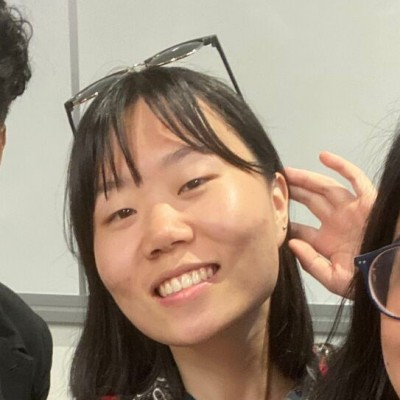

# Team Information

## Ethan Cook

Student Number: 1008075388
UTORID: cooketh3
Email: ethanwayne.cook@mail.utoronto.ca

I am a 3rd year Computer Science student at University of Toronto Scarborough with a focus on Software Development. Passionate in developing scalable, high quality web and games software with readable, optimized, and well tested code. In my spare time, my main hobby is music. I play Trombone and Piano, and enjoy most to play jazz music.

## Sean Shekhtman

Student Number: 1008305371
UTORID: schekhtm
Email: sean.shekhtman@mail.utoronto.ca

I’m Sean Shekhtman! A friendly guy who enjoys going (very) deep into things, and so I may be a bit slow at times. Once I’m satisfied, I begin my work at a break-neck pace! I’ve worked with a few open-source projects here and there, during my free time. I enjoy helping people understand concepts and bouncing different ideas to look for the most efficient (though perhaps not the most readable) solutions. My favourite programming language is C, as I find it to be the easiest to debug and maintains a close relationship with the hardware. As you can tell, I’m a pretty low-level guy, so things like Java or CSS may take me some time to get used to. Looking forward to working with my group!

## Francis Ayyad

Student Number: 1008091985
UTORID: ayyadfra
email: francis.ayyad@mail.utoronto.ca

Hey, I'm Francis Ayyad. I'm a third year Computer Science student Specializing in Software Engineering and minoring in statistics. I have some web development expreience with PHP gained through my co-op experience. My favoirte programming language is C since I am probbably best at this language from University. In my free time, I enjoy watching football/soccer games and supporting FC Barcelona!

## Juno Zhang

Student Number: 1007925872
UTORID: zha11325
email: juno.zhang@mail.utoronto.ca

Hi! My name is Juno, and I am a third year Computer Scienece student at the University of Toronto Scarborough. I enjoy systems programming and generally working in low-level environments. I have experience working with computer hardware, etching PCB boards and tinkering with Arduino kits. In my spare time, I am interested in printmaking, and I also self-publish comics, which inspires me to explore intersections between visual arts and technology. 

## Alex Zeng

Student Number: 1008064381
UTORID: zengwe11
email: a.zeng@mail.utoronto.ca

Hello there, I'm Alex! I am currently in my third year of my Computer Science Specialist and Statistic Minor. I think Computer Science is a fascinating field of study given the wide coverage from fundamentals on how a computer functions to advanced topics such as artificial intelligence. I have experience working with Agile deveopment in languages such as Python, JavaScript, and C++. Recently, I've gained in interest in artificial intelligence and machine learning as I think these are technologies that will shape the future. I hope I could put my knowledge to good use for this project!

## Zack Steine
Student Number: 1007533313
UTORID: steineza
email: zack.steine@mail.utoronto.ca

Hi everyone, I'm Zack. I'm in my third year at the University of Toronto where I am doing a Computer Science Specialist and Statistics Major. I am interested in the theory of statistics and using it to solve complex problems with machine learning. My experience is mainly from my 16 month coop as a Java developer, but I am also doing a project course right now on a webapp in Angular. In my free time I like to watch hockey, pet cats, go to the gym, and eat food that I cook and bake. 

## Neil Wang

Hey there! My name is Neil and I'm currently a third year Computer Science student at UTSC. Specializing in software engineering, I enjoy designing practical applications that I can use in my day-to-day life. I'm currently working on creating a website analytics extension for google to track how I spend my time on the internet. Coming from a full-stack background, I am proficient in both front-end (JavaScript, React.js, etc.) and back-end (Ruby, NoSQL, etc.) technologies. I look forward to building a web application to help the grant process!

Student Number: 1007731983
UTORID: wangnei3
email: neily.wang@mail.utoronto.ca

